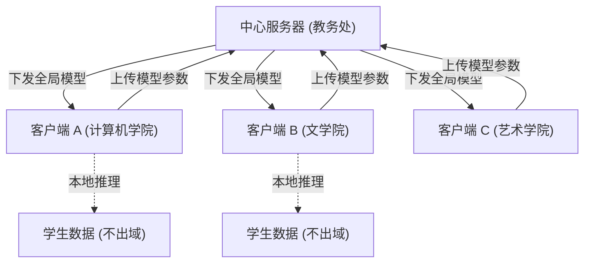

# 工业化部署协议：Fair-Fed-CI v2 校园落地指南

## 1. 部署架构 (Deployment Architecture)

本系统采用 **Server-Client 联邦架构**，适用于多学院（多校区）的分布式部署场景。



## 2. 部署流程 (Step-by-Step)

### 阶段一：中心服务器搭建 (Server Setup)
**执行方**：校级教务处 / 信息中心
1.  **硬件要求**：一台高性能服务器（推荐 GPU: NVIDIA A100/3090，内存 64GB+）。
2.  **软件环境**：安装 Python 3.9+, PyTorch, Flower (flwr)。
3.  **启动服务**：
    ```bash
    python src/fed_core.py --role server --rounds 50
    ```
    *注：服务器将监听端口，等待各学院连接。*

### 阶段二：学院客户端部署 (Client Deployment)
**执行方**：各学院教务员
1.  **硬件要求**：普通办公电脑或学院服务器（CPU 即可，推荐 16GB 内存）。
2.  **数据准备**：导出本学院学生成绩单 (`college_data.csv`)，放置于 `data/` 目录。
3.  **启动连接**：
    ```bash
    python src/fed_core.py --role client --server_ip "192.168.1.100" --data_path "data/college_data.csv"
    ```
    *注：客户端会自动下载最新模型，利用本地数据进行训练，并上传参数。*

### 阶段三：模型迭代与优化 (Optimization)
1.  **冷启动**：初次部署时，建议进行 10-20 轮联邦训练，以获得一个通用的基础模型。
2.  **个性化微调 (Personalization)**：
    - 训练完成后，每个客户端会获得一个 **Personalized Head**（私有层）。
    - 该层专门适应本学院的评分标准（如艺术学院偏重作品集，理学院偏重考试）。
3.  **增量更新**：每学期结束后，重新启动一轮联邦训练，吸纳新学期的数据，保持模型时效性。

## 3. 预测与干预 (Prediction & Intervention)
**场景**：新学期开始前，辅导员使用系统进行预警。

1.  **批量预测**：
    ```bash
    python -m src.system_app --batch_predict --output "warning_list.xlsx"
    ```
2.  **个案分析**：
    针对高风险学生，生成可视化归因报告：
    ```bash
    python -m src.system_app --student_id "2021001" --plot
    ```
3.  **人工干预**：
    辅导员根据报告中的“核心原因”（如：高数挂科），安排针对性的辅导或谈话。

## 4. 数据安全协议 (Security Protocol)
- **原则**：原始数据（成绩单、学生隐私）**严禁离开学院客户端**。
- **传输**：仅传输模型梯度/参数（Weights/Gradients）。
- **加密**：建议在传输层开启 SSL/TLS 加密。

---
**附录：常见问题**
- Q: 某个学院数据量很少怎么办？
- A: 联邦学习的优势正是“以多帮少”。该学院可以利用其他学院贡献的“通用知识 (Encoder)”，即使只有几十个样本也能获得不错的预测效果。
