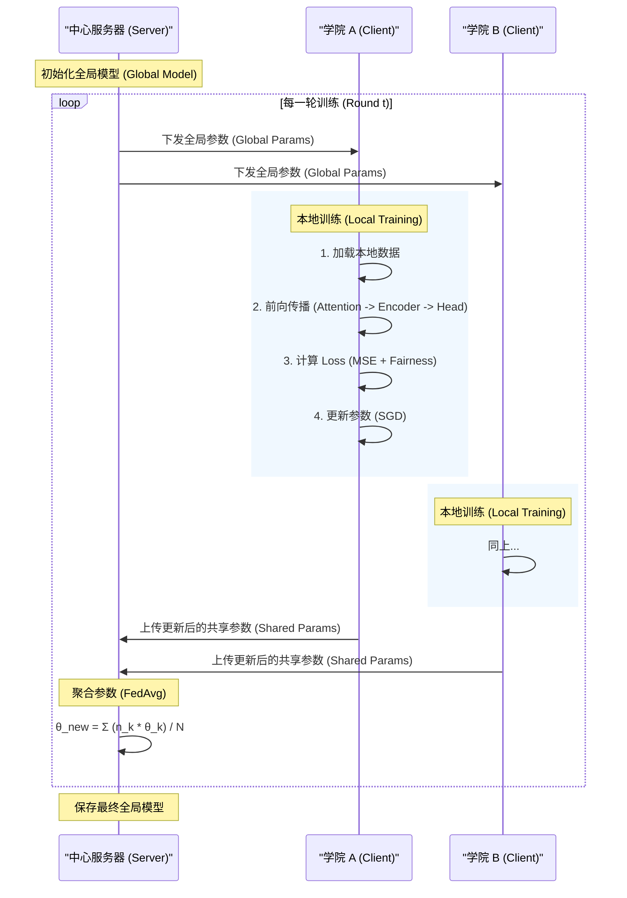
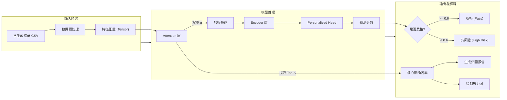
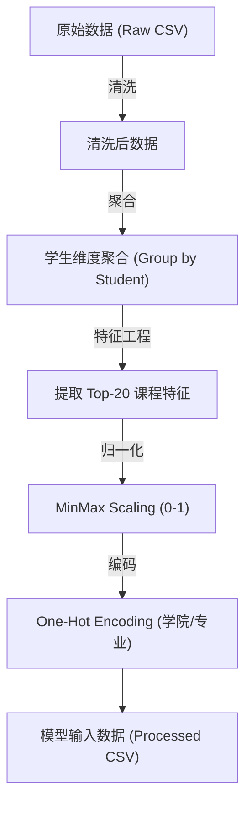

# Fair-Fed-CI v2 系统流程图集

## 1. 联邦训练流程 (Federated Training Workflow)

```mermaid
sequenceDiagram
    participant Server as "中心服务器 (Server)"
    participant ClientA as "学院 A (Client)"
    participant ClientB as "学院 B (Client)"

    Note over Server: 初始化全局模型 (Global Model)
    
    loop 每一轮训练 (Round t)
        Server->>ClientA: 下发全局参数 (Global Params)
        Server->>ClientB: 下发全局参数 (Global Params)
        
        rect rgb(240, 248, 255)
            Note over ClientA: 本地训练 (Local Training)
            ClientA->>ClientA: 1. 加载本地数据
            ClientA->>ClientA: 2. 前向传播 (Attention -> Encoder -> Head)
            ClientA->>ClientA: 3. 计算 Loss (MSE + Fairness)
            ClientA->>ClientA: 4. 更新参数 (SGD)
        end
        
        rect rgb(240, 248, 255)
            Note over ClientB: 本地训练 (Local Training)
            ClientB->>ClientB: 同上...
        end

        ClientA->>Server: 上传更新后的共享参数 (Shared Params)
        ClientB->>Server: 上传更新后的共享参数 (Shared Params)
        
        Note over Server: 聚合参数 (FedAvg)
        Server->>Server: θ_new = Σ (n_k * θ_k) / N
    end
    
    Note over Server: 保存最终全局模型
```

## 2. 预测与解释流程 (Prediction & Explanation Pipeline)

```mermaid
flowchart LR
    subgraph Input [输入阶段]
        Data["学生成绩单 CSV"] --> Preprocess[数据预处理]
        Preprocess --> Tensor["特征张量 (Tensor)"]
    end

    subgraph Model [模型推理]
        Tensor --> Attn[Attention 层]
        Attn -->|权重 α| Weighted[加权特征]
        Weighted --> Enc[Encoder 层]
        Enc --> Head[Personalized Head]
        Head --> Score[预测分数]
    end

    subgraph Output [输出与解释]
        Score --> Decision{是否及格?}
        Decision -->|>= 0.6| Pass["及格 (Pass)"]
        Decision -->|< 0.6| Fail["高风险 (High Risk)"]
        
        Attn -->|提取 Top-K| KeyFactors[核心影响因素]
        KeyFactors --> Report[生成归因报告]
        KeyFactors --> Plot[绘制热力图]
    end

    Input --> Model
    Model --> Output
```

## 3. 数据处理流水线 (Data Processing Pipeline)

```mermaid
graph TD
    Raw["原始数据 (Raw CSV)"] -->|清洗| Clean[清洗后数据]
    Clean -->|聚合| Agg["学生维度聚合 (Group by Student)"]
    Agg -->|特征工程| Feat[提取 Top-20 课程特征]
    Feat -->|归一化| Norm["MinMax Scaling (0-1)"]
    Norm -->|编码| Encode["One-Hot Encoding (学院/专业)"]
    Encode --> Final["模型输入数据 (Processed CSV)"]
```
